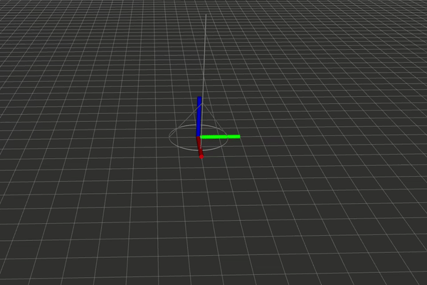
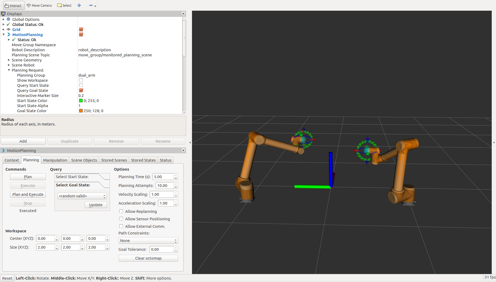

# *rockwalk*

*rockwalk* is an efficient technique to transport large objects in a passive dynamic manner. First proposed in an ICRA'19 [paper](http://junseo.people.ust.hk/papers/rnw.pdf).

   

*TO DO:* Add contact plot.

## *rockwalk* with UR-10

### Gazebo

### Real World

<!-- # Rock and Walk Manipulation with UR-10 Robot Arm

##  Usage
This repository is a workspace that contains `MoveIt!`, `ur_modern_driver` and some other packages to perform rock-and-walk manipulation ([manuscript](http://junseo.people.ust.hk/papers/rnw.pdf), [video](https://drive.google.com/file/d/1CDzb0HQTZxM8v69VRgbU-VmYGj-cTmHZ/view?usp=sharing)) with a UR-10 robot arm. The setup here is general to facilitate dual arm control of UR-10s in our laboratory setting. If you would like to use the two UR-10 arms for some other manipulation task, then you can setup your workspace as prescribed below and scroll down to Robot Control section to begin controlling one or two UR-10 arms. We assume **Ubuntu 16.04** with **ROS Kinetic** installed.

### 1.  Setting-up the Workspace

1.  Install `trac_ik` plugin  
`$  sudo apt-get install ros-kinetic-trac-ik-kinematics-plugin`

2.  Then, install `catkin_tools` using `apt-get` as described [here](https://catkin-tools.readthedocs.io/en/latest/installing.html).

3.  Clone this repository into your home directory, and rename it to `ws_moveit`  
`$  git clone https://github.com/HKUST-RML/PRW-Manipulation.git`

4.  Enter the `ws_moveit` directory and run the following commands to initialize and clean up the workspace with catkin  
`$  cd ws_moveit`  
`$  catkin init`  
`$  catkin clean`  

5.  Then build the workspace. This will take 15-20 minutes. There may be a few warnings. Just ignore them.  
`$  catkin build`

6. Finally, source your new workspace everytime before use, or add it to your `.bashrc` script so that it is executed everytime you open the terminal.  
`$  source ~/ws_moveit/devel/setup.bash`

### 2.  Demo with MoveIt!

1.  The following command will bring-up two virtual UR-10 robots as in our lab setting.  
`$  roslaunch ur10_dual_arm_gazebo_moveit_config demo.launch`  
Note, this has nothing to do with Gazebo simulator. Just the naming has been this way. Play around with these two arms by following MoveIt tutorials [this](https://ros-planning.github.io/moveit_tutorials/doc/quickstart_in_rviz/quickstart_in_rviz_tutorial.html) and [this](https://ros-planning.github.io/moveit_tutorials/doc/move_group_python_interface/move_group_python_interface_tutorial.html). You can also plan paths for the robots in RViz, as in this sceengrab:

2.  You can also run the following script to visualize a dual-arm zigzag motion. Turn-off loop-animation in RViz. Take a look at the script to see how the robot is being controlled using MoveIt.  
`$  rosrun ur10_cm hong_kong_dual_arm_manipulation_operational.py`  

3.  You can also practice writing your own code to come up with interesting robot motions like planning a circle, a spiral, etc. with one or both robot arms.

###  Concatenating gait and generating waypoints for the robot
Here, we use the `MATLAB` scripts to generate a sequence of zigzag waypoints along
which the robot can move. The `MATLAB` scripts are located in the directory, `/src/ur10_cm/matlab_scripts`

1.  First execute `vector_fields.m` in `MATLAB` with dimensions of oblique cone of choice. This will generate three files, namely, `vector_field_pos.mat`, `vector_field_neg.mat` and `params.mat`. The former two store the annular vector fields while the latter stores the associated parameters. These three files will be used by `integral_curves_concatenate.m` in the next step. In addition, `vector_fields.m` will display a figure showing an annulus filled with CCW vector field and an example streamline. The streamline denotes the path of the ground contact point on the base rim of the cone (see the manuscript in the reference below). Note: The code here is inefficient, so it may take a couple of minutes in runtime.

2. Then run `integral_curves_concatenate.m`. This script outputs a file, `lr_rocking.mat` to store the sequence of oblique cone's apex positions (correspondingly, the end-effector positions of a robot manipulator attached to the cone's apex), separated into two variables corresponding to left and right rocking. If these sequence of waypoints are followed, a net straight line displacement of the cone is obtained through alternate rocking. In this script, total number of rocking steps (`total_rocking_steps`) and `rocking_angle` may be altered. A large value of `rocking_angle` means that the end-effector moves large displacement per step and can potentially make the system (robot+object_cone) unstable. A small value, on the other hand, will result in a small net forward displacement per rocking step.

###  Robot Control
In our lab, the two UR-10 arms named `hong` and `kong`. We use these names to
create ROS namespaces for our robot arms.

**CAUTION: The following steps are to execute real robot motion. Keep the emergency stop button close at all times in case the robot controller fails or the robot exhibits any weird motion**

1. First configure the network between your laptop and the UR-10 robot arms. Enter the robot IPs in the file `/src/ur10_cm/launch/dual_arm_execution.launch`. You can obtain the robot IP using its teaching pedant. Because, we will be using only `kong` arm here, so just configure the IP of this robot arm.

2. In the command line run the following command  
`$  roslaunch ur10_cm dual_arm_execution.launch`  
This will setup the robot controllers as well as `MoveIt!`. An `RViz` window will also pop-up which can be used to visually plan the motion of the real robot arms.

TO DO: UPLOAD ARDUINO CODE.

3. The robot control takes as input the data from a 9-axis motion shield mounted on the object. Connect the Arduino mounted on the object to your robot using a USB cable and begin receiving data from the motion shield, by running the following command  
`$  rosrun rosserial_python serial_node.py _port:=/dev/ttyACM0 _baud:=115200`

4. For object cone's visualization, we also use a camera, together with an AprilTag printed on the object. If a camera is connected, the first command will load the camera driver. If the camera can see the AprilTag of `id: 4`, it will begin streaming its pose on a particular `rostopic`. Feel free to tweak their launch files to configure according to your camera or the available AprilTag.  
`$  roslaunch usb_cam usb_cam-test.launch `  
`$  roslaunch apriltags_ros example.launch`

5. Then, the following command will run a node to visualize the object cone and publish its Euler angles. Successfully executing this script requires that AprilTag is published at least initially. We have to modify this, or remove AprilTag dependency altogether from future commits.  
`$  rosrun ur10_cm cone_pose_visualization.py`

Setup the robot arm and the object as in the [demonstration video](https://drive.google.com/file/d/1CDzb0HQTZxM8v69VRgbU-VmYGj-cTmHZ/view?usp=sharing). The robot control script which we will use to execute the motion of the robot arm has two components: (1) initialization in which the robot initializes to a specified pose. and (2) rock-and-walk where the robot arm moves in a zigzag path according to the waypoints stored in `lr_rocking.mat`. The `z` coordinate in the robot initialization should be adjusted based on the height parameter with which `lr_rocking.mat` was generated. Note that some subtraction by a constant is required here because of the difference in the location of the world frame of the robot which is it at the level of the table support. Also, set the initial configuration of the robot arm (before running the script) close to that in the demo video using teaching pedant to avoid any weird motions of the robot.

6. Run the following command to initialize and implement rock-and-walk motion with the robot arm.  
`$  rosrun ur10_cm kong_rigid_effector_control.py`

*Note: In the above script, we have commented out the command* `self._group.execute(plan)` *which executes real robot motion. So first visualize the motion in RViz and then uncomment it to execute the motion in a real setting.*

##  Demonstration
To see how the parameters are defined and a demo of our manipulation task, take a look at the following video.

##  References
Read our [manuscript](http://junseo.people.ust.hk/papers/rnw.pdf) to be presented at ICRA'19.  

##  Questions or Comments?
Feel free to contact: sanazir[at]connect[dot]ust[dot]hk -->
